# 🏗️ Legal AI System Architecture & Data Flow

This document explains how the backend data structures connect to the AI features and analytics dashboards.

---

## 1. 🧬 Entity Relationship Model
How judges connect to cases, opinions, and courts.

```mermaid
graph TD
    Judge["👨‍⚖️ Judge"] -->|Authors| Opinion["📄 Opinion"]
    Judge -->|Served In| Court["🏛️ Court"]
    
    Opinion -->|Part Of| OpinionCluster["📦 OpinionCluster (Decision)"]
    OpinionCluster -->|Belongs to| Docket["📁 Docket (The Case)"]
    
    Docket -->|Filed In| Court
    
    Judge ---|Direct Link for Analytics| JudgeDocketRelation["🔗 Judge-Docket Relation"]
    JudgeDocketRelation --- Docket
    
    Opinion -->|Cites| OpinionsCited["📑 Citations"]
    OpinionsCited --> Opinion
```

### 🔗 Real-World Example:
1.  **Judge Sarah Mitchell** is serving in the **Superior Court of California**.
2.  She writes an **Opinion** for a specific case.
3.  This opinion is grouped into an **OpinionCluster** (which covers the whole decision, including dissents).
4.  The decision is part of **Docket #12345** (The Lawsuit: *Smith v. Corp*).
5.  **Our System** creates a `JudgeDocketRelation` between Mitchell and the Docket to store that she was the **Author** and the case was **Granted**.

---

## 2. 🔍 How Legal Research Works
When a user asks: *"What is the burden of proof in Title VII discrimination cases?"*

### **Step 1: Semantic Discovery (AI)**
The system takes the user's English question and converts it into a **Vector Embedding** (a list of 1,536 numbers representing the "meaning").

### **Step 2: Vector Search**
It searches the `opinions` table using **pgvector**. 
- It finds opinions where the text mentions the "McDonnell Douglas burden-shifting framework".
- These opinions are ranked by how closely they match the "meaning" of the question.

### **Step 3: Synthesis (LLM)**
The system sends the **Top 5 Opinions** + the **User Question** to an LLM (GPT-4o).
- **The LLM** summarizes the law based *only* on the verified opinions found.
- **The Backend** maps the opinion IDs back to their Dockets to show you the **Citations** (e.g., *McDonnell Douglas Corp. v. Green*).

---

## 3. 📊 How Judge Analytics Work
How we power the "78% Grant Rate" and "45 days Avg Decision" cards.

| Metric | Calculation Logic |
| :--- | :--- |
| **Total Cases** | Count of `JudgeDocketRelation` records for that judge. |
| **Grant Rate** | `(Court Cases where outcome_status contains 'grant') / (Total Decided Cases)` |
| **Avg Decision Days** | Average of `decision_days` stored on the `Docket` model. |
| **Monetary Capture** | Extracted from `nature_of_suit` or `cause` using regex pattern matching. |
| **Specialty Area** | The top Recurring `nature_of_suit` in the judge's case history. |

---

## 🔮 4. How Predictive AI Works
When you enter case details for a **Prediction**:

1.  **Historical Matching**: The AI looks at **Sarah Mitchell's** past 1,000 cases.
2.  **Context Loading**: It finds similar cases (same Jurisdiction, same Case Type).
3.  **Probability Engine**: 
    -   If Mitchell has ruled "Granted" in 90% of "Employment Discrimination" cases...
    -   ...the success probability increases.
4.  **Final Report**: The AI generates a success probability (e.g., **87.3%**) based on the judge's actual historical ruling patterns found in our database.

---

## 🛠️ Data Origin
- **Bio/Education**: From CourtListener `People` API.
- **Opinions**: From CourtListener `Opinions` API.
- **Case Timing/Status**: Extracted from `Dockets` and `OpinionClusters`.
- **Citations**: From `OpinionsCited` network mapping.
